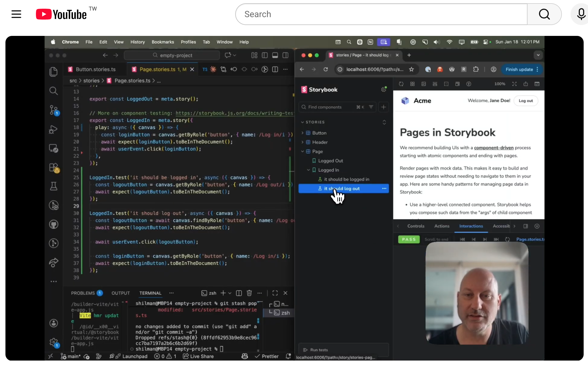

# CSF Next Demo

The code used in a [demo video for CSF Next](https://www.youtube.com/watch?v=UWqAKHL9AqY), demonstrating:

- [Typesafe CSF factories](https://github.com/storybookjs/storybook/discussions/30112)
- [Tags and Sidebar filtering](https://storybook.js.org/docs/writing-stories/tags)
- [Experimental test syntax](https://github.com/storybookjs/storybook/discussions/30119)

For a more complex example, we've also upgraded [Mealdrop](https://github.com/yannbf/mealdrop) to use the new language features: [PR](https://github.com/yannbf/mealdrop/pull/52), [Storybook](https://5f84c5baa35bdd0022a7684f-jhyxsggsll.chromatic.com/)
